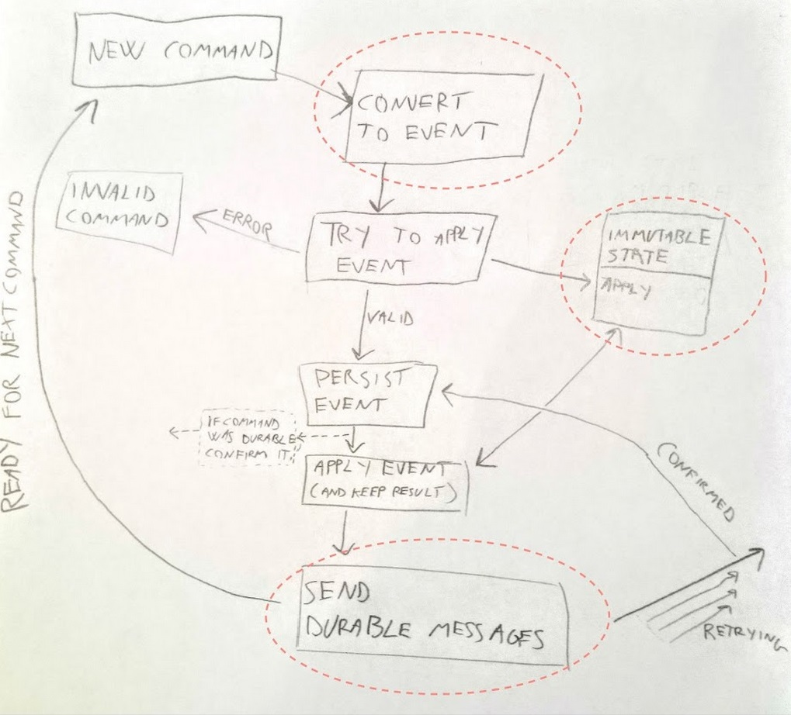

Akka Tools Persistence
==============================

This project main purpose is to make Akka Persistence more easy to use.

The main components are:

* **GeneralAggregate** - which is built on top of PersistentActor
* **GeneralAggregateView** - which is built on top of PersistentView 

It includes features like:

* Separation of aggregate, view and state(machine)
* both aggregate and view understands the same events and uses the same "state machine"
* integrated cluster/sharding-support
* Simplified AtLeastOnceDelivery-support
* Automatic starting and stopping (of idle) aggregates and views
* Automatic working view that supports getting the current state (ie. to be used from REST) and the full event history (nice when debugging)

The concept
=====================

The above images shows how GeneralAggregate works.

The red parts indicates what you need to implement.

In short, this is how it works:

Below is a more detailed explanation of some terms: 

Commands
--------------
Commands are sent to a GeneralAggregate from the outside world.

If valid, they may result in an Event/statechange.

They must extend AggregateCmd since we support sharding.

Events
--------------
Events are representing changes to our state and are persisted in the Journal.

They drive the state-machine and may produce *DurableMessages*

DurableMessage
----------------
DurableMessage is a way of using AtLeastOnceDelivery.

When you need to send something with AtLeastOnceDelivery, you send it as a DurableMessage.
The receiver will call confirm() to signal that the message is processed.

When a GeneralAggregate receives a DurableMessage, it will automatically confirm it,
if the received Command was processed successfully or if an expected error happened.

Another nice feature is that we can replace the payload of a DurableMessage before sending it
to someone else.

Example usecase:

If a GeneralAggregate needs to get some information, it sends a DurableMessage to a plain actor.
The plain actor gets the information, and replaces the payload of the DurableMessage before sending it back
to the GeneralAggregate.

The Aggregate will then recieve the data as a command, and if it is happy with it, it will confirm the DurableMessage.
It is actually confirming its own DurableMessage.

In an error-situation, where the plain actor died, the auto-retrying mechanism would send it again, and this time it might work.

Expected error
---------------
This is an error of type AggregateError.

An example of an expected error is "We understand what you ask for, but it is an invalid operation given our current state".
In such situations we must confirm the message to stop the auto-retry-mechanism. 

NullPointerException is a typical example of an unexpected error..

The state (machine)
-----------

A GeneralAggregate has its complete state represented in a single

    var state:AggregateState

The AggregateState is immutable and has one method:

    def transition(event:E):AggregateState

This method is used both when testing if incoming events are valid, and when change our state when events are applied.

It is also used in GeneralAggregateView to make sure we get the same state there.

GeneralAggregate
------------------

GeneralAggregate receives commands and tries to convert them into an event.
The event is then validated by trying to apply it to the state (machine).
If the event is valid, then it is written to the journal.

Before we change the state (machine), we check to see if applying this event should result in
any DurableMessages (Do we need to send an important durable message to some other actor or Aggregate?).

After any DurableMessages has been sent (AtLeastOnceDelivery), we apply the event to the state (machine)
and store the new current state.

Configuration
---------------------

As a convenience, you can include the following config enabling sharding

    include classpath("akka-tools-sharding")

Example
--------------------------

An [example-application can be found here](../examples/aggregates/)